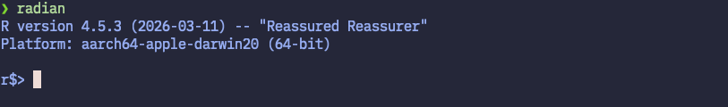
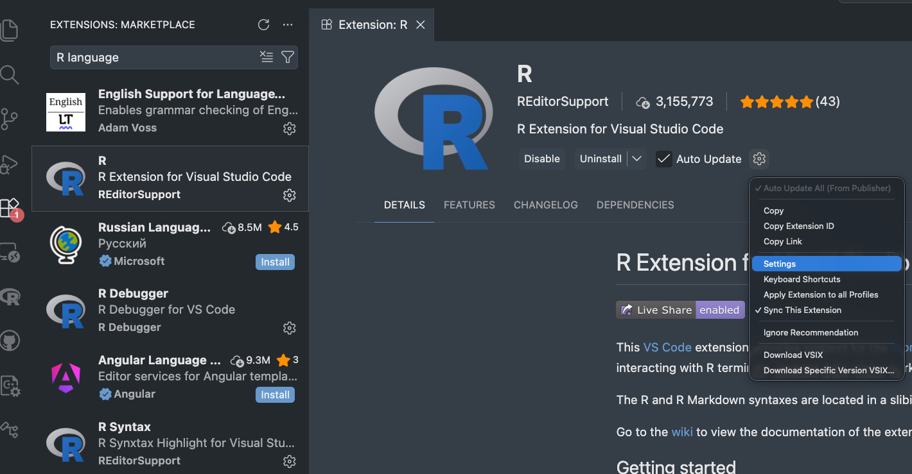
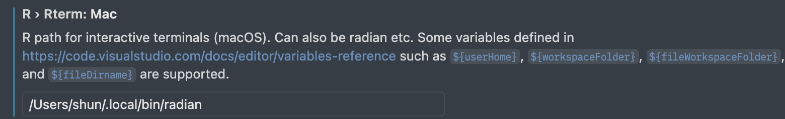
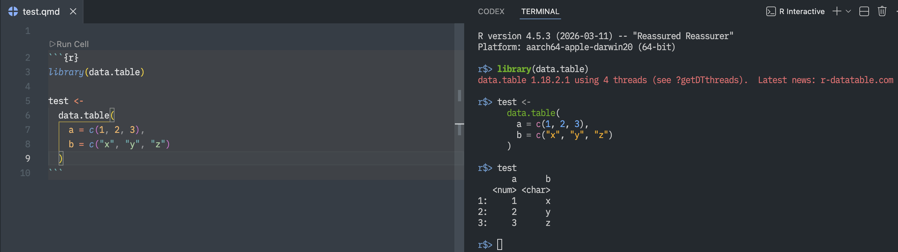
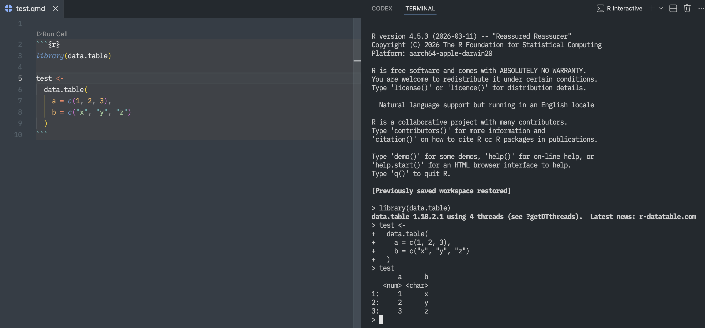
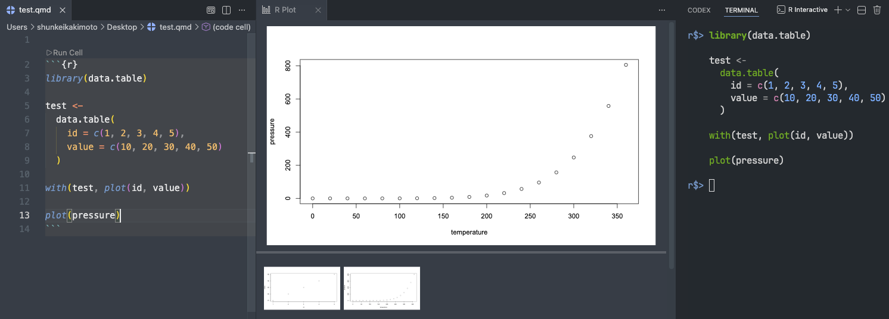
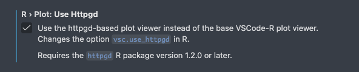

# Introduction

This appendix provides a step-by-step guide on how to set up and use R on Visual Studio Code (VS Code). While many existing guides cover this setup, they are often outdated and/or rely on the base R console (the standard R REPL) running in the VS Code terminal. This approach works, but it offers limited functionality and lacks features such as syntax highlighting and efficient multiline editing.

Instead, this guide uses **"Radian"** (github repository is [here](https://github.com/randy3k/radian)), a modern console for R that provides capabilities such as syntax highlighting and improved command-line interaction via code completion.

The setup process involves installing Radian and configuring VS Code to use it as the default R console. By following the instructions in this appendix, I believe you will have a much better experience when working with R in VS Code.

The entire setup should take no more than 10 minutes.

# Prerequisites
Before you begin, make sure you have the following installed on your computer:

+ R (version 3.4.0 or higher)
+ VScode
  + R extension for VS Code 
+ Python (version 3.9 or higher) to install pipx.

# Let's get started!

## Step 1: Install Radian

### Make sure you have `pipx` installed
The recommended way to install Radian is through `pipx`, which allows you to install and run Python applications in isolated environments (so that they do not interfere with other Python packages on your system). 

Check if you already have `pipx` installed by running the following command on your terminal:

```bash
pipx --version
```

If you see a version number, you have `pipx` installed. If not, install it with:

```bash
python3 -m pip install --user pipx
python3 -m pipx ensurepath
```
After running the above commands, restart your terminal. 

### Install Radian

Once you have `pipx` installed, you can install Radian with the following command:

```bash
pipx install radian
```

To verify that Radian is installed correctly, run:

```bash
radian
```

You should see the Radian console start up, which looks like this:

{width="100%"}


## Step 2: Configure VS Code to use Radian

Next, we need to configure VS Code to use Radian as the default R console.

First, open VS code and find the R extension settings. You can do this by going to the Extensions view (Ctrl+Shift+X on Windows/Linux, Cmd+Shift+X on Mac), searching for "R language", and clicking on the gear icon on the R extension page. Then, click on "Settings".

{width="80%"}

**It will open the settings page for the R extension. In the settings page, we modify four settings:**

**1. check `R: Always Use Active Terminal`**

+ This setting ensures that the R extension always uses the active terminal for running R code, which is useful when you have multiple terminals open in VS Code.

**2. check `R: Bracketed Paste`**

+ This sends code to the R console (e.g., Radian) as a single block, preventing line-by-line execution and ensuring multi-line code runs correctly.

**3. set `R > Rterm: Mac` to the path of Radian**

+ *NOTE: If you are using Windows or Linux, set `R: Rterm: Windows` or `R: Rterm: Linux` instead.*
+ This setting specifies the path to the R terminal executable that VS Code will use. Since we want to use Radian, we need to provide the path to the Radian executable here.

To find the path of Radian, run `which radian` on your terminal, and copy and paste the returned path into the `R: Rterm: Mac` setting. In my case, it looks like this:

{width="80%"}


**4. Remove options in `Rterm Options`**

+ Since Radian does not support the default options used by the R extension, we need to clear the options in the `Rterm Options` setting. To do this, simply delete any text in the `Rterm: Options` (e.g., `--no-save` and `--no-restore`) field and leave it blank.

## Step 3: Open R terminal in VS Code

Now that we have configured VS Code to use Radian, we can open the R terminal with Radian in VS Code.

To open the R terminal, you can use the command palette (Ctrl+Shift+P on Windows/Linux, Cmd+Shift+P on Mac) and type "R terminal". Then, select `R: Create R terminal` from the list of commands. This will open a new terminal in VS Code with Radian running.

Now, any R code you run in VS Code will be executed in the Radian console. To open a new R terminal with Radian, simply repeat the above step. You can have multiple Radian terminals open in VS Code at the same time, and you can switch between them using the terminal tabs. Note that the R code you run in VS Code will be sent to the active Radian terminal. To quit Radian, simply type `quit()` in the Radian console and press Enter.

Below are the screenshots of the R terminal with Radian running in VS Code. For comparison, the bottom screenshot shows the default R terminal in VS Code without Radian. It is clear that the Radian console provides a more easily readable.

{width="100%"}


{width="100%"}

# Conclusion

In this appendix, we have provided a step-by-step guide on how to set up and use R on Visual Studio Code (VS Code) with Radian, a modern console for R. It is highly recommended to use Radian instead of the default R REPL in VS Code. Additional tips for using R in VS Code are provided in the Bonus section below. 

# Bonus: 

Here are some additional tips for using R in VS Code:

## Customize Radian with profile file

You can customize Radian's behavior by specifying options in the profile file. First, let's create a profile file. For Unix-based systems (e.g., Mac and Linux), the recommended location is `$HOME/.config/radian/profile` (consistent with common locations for user-defined application configuration files). For Windows, you can create the profile file at `%USERPROFILE%\radian\profile`. When you start Radian, it will automatically read the options specified in the profile file and apply them to your Radian console.

For macOS and Linux, you can create the profile file with the following commands in your terminal:

```bash
mkdir -p $HOME/.config/radian
touch $HOME/.config/radian/profile
```

For Windows, you can create the profile file with the following commands in Command Prompt:

```cmd
mkdir %USERPROFILE%\radian
type nul > %USERPROFILE%\radian\profile
```

Then, open the `profile` file with a text editor (e.g., `code $HOME/.config/radian/profile` to open it in VS Code), and add the options you want to use with Radian. For available options, see the "Settings" section in the Radian GitHub repository ([here](https://github.com/randy3k/radian?tab=readme-ov-file#settings)).

For example, you can add the following options to the profile file:

```bash
# highlight matching bracket
options(
  # Use vi keybindings in Radian (hitting `Esc` will switch to normal mode, and you can use `i` to switch back to insert mode)
  radian.editing_mode = "vim",
  # Show vi mode state
  radian.show_vi_mode_prompt = TRUE,
  radian.vi_mode_prompt = "\033[0;34m[{}]\033[0m ",
  # typing (, {, and [ will automatically insert the corresponding closing brackets
  radian.auto_match = TRUE,
  # highlight matching brackets
  radian.highlight_matching_bracket = TRUE,
  # pop up completion while typing
  radian.complete_while_typing = TRUE,
  # switch to python console by typing `~`
  radian.enable_reticulate_prompt = TRUE
)
```


## Use `httpgd` to view plots in VS Code for a better plotting experience

By default, plots generated in R within VS Code are displayed in an external graphics window. The `httpgd` package (GitHub repository is [here](https://github.com/nx10/httpgd)) is an R package that provides alternative graphics device by rendering plots in a browser-based viewer integrated with VS Code. It has interactive features such as zooming and plot history.

Below is example of how plots are displayed with `httpgd` in VS Code. 

{width="100%"}


### How to set up `httpgd` in VS Code

To enable this feature, first we need to install the `httpgd` package in R, and then configure VS Code setting to use `httpgd` for plotting. 

Install `httpgd` package in R in a usual way:

```r
install.packages("httpgd")
```

Then, open the VS Code settings for the R extension (as described in Step 2), and enable `R > Plot: Use Httpgd`. 

{width="60%"}

Test if the setup works by opening R terminal and plotting something (e.g., `plot(1:10)`). The plot should be displayed in the Plot pane in VS Code. 


