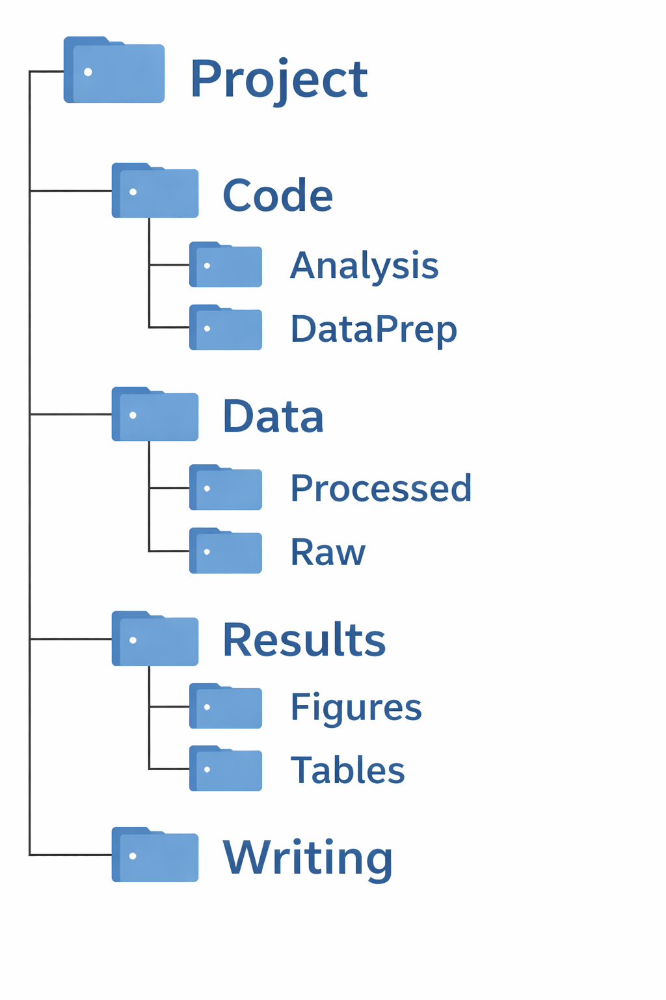

##  Today's Outline

+ Motivation: Why, what, and how of reproducibility in scientific research

+ Example of a reproducible project

# Motivation: Why Reproducibility Matters in Scientific Research?

## Growing Interest in Enhancing Transparency and Reproducibility in Academia

<!-- > ***"One of the pathways by which the scientific community confirms the validity of a new scientific discovery is by repeating the research that produce it"*** --  from the report of "Reproducibility and Replicability in Science" (@NationalAcademiesofSciences.etal2019) -->

Reproducibility has always been a core scientific principle.
However, it has become a growing concern in modern research.

### **Why now?**

- Increasingly complex data and code pipelines [@NationalAcademiesofSciences.etal2019]
- Hidden steps and undocumented decisions [@Gentzkow.Shapiro2014]
- Incentives favor speed over transparency [@Franco.etal2014]  

### **Implications**

- Results are hard to verify 
- Reproducibility often fails even when data and code are available [@Chang.Li2018]  
- Credibility of research is at risk [@Baker2016]

### **Takeaway**

+ Reproducibility practices are no longer optional—they are essential.

:::{.notes}
+ Reproducibility is not a new concern. It is a longstanding norm of science. 
+ The reason might be because that research became more computationally complex.

+ AEA: Data and Code Availability Policy (https://www.aeaweb.org/journals/data/data-code-policy?utm_source=chatgpt.com)
:::

## What is Reproducibility? {.center}

:::{.callout-important}
## Definition: Reproducibility
*Reproducibility refers to **the ability of a researcher to duplicate the results of a prior study using the same materials as were used by the original investigator**[@Cacioppo.etal2015]*.
:::

 

<!-- :::{.callout-note}
## Definitions: Replicability
*A research study is **replicable** if other teams reach the same conclusion by applying the same procedure to the difference materials (e.g., data).*
:::

   -->

In essence, reproducibility asks:

["**Can another researcher go from raw data to final results using only the materials you provide?**"]{style="color:var(--light-maroon);"}

 

So, what should we do to make our research reproducible?

:::{.notes}
+ Reproducing research involves using the original data and code, while replicating research involves new data collection and similar methods used in previous studies, the report says. Even when a study was rigorously conducted according to best practices, correctly analyzed, and transparently reported, it may fail to be replicated. (https://phys.org/news/2019-05-replicability-science.html)

:::

## Key Components of Reproducible Research

<!-- Start of panel-tabset -->
::: {.panel-tabset}

### Basics
::: {.callout-important}
## Minimum Rule
Every single action taken during the entire research process is documented in a way that anybody can follow to implement the same actions (no hidden actions) to produce exactly the same results.
:::
 
To achieve high-quality reproducibility in practice, the following components are essential:

::: {.columns}

::: {.column width="25%" .center-text}
**(i) Organized Project Folder** 

{width="65%"}
:::

::: {.column width="40%" .center-text}
**(ii) Streamlined Code**
{width="150%"}
:::

::: {.column width="35%" .center-text}
**(iii) Comprehensive Documentation**
{width="100%"}

:::

:::

### File organization

Place code files, data files, and documentation files in the right folders with clear names

[**For example**]{style="color:var(--light-maroon);"}

+ Data/Raw folder should contain the original data files, and Data/Processed folder should contain the cleaned data files.
+ 

### Streamlined code

Automate

### Comprehensive documentation

:::
<!-- End of panel-tabset -->

::: {.notes}
+ The minimum rule ensures that a project is reproducible in principle. However, this alone does not guarantee that the research is easy to understand, verify, or reuse. High-quality reproducibility requires additional structure and clarity.

+ Organizing the project folder is the easiest one to implement, and you can do this from today. 

+ The third component, which is comprehensive documentation, is also relatively easy to implement. You can start by writing a README file that explains the data sources, methods, and reproduction steps. For example, you can look at the README file of the Justin's github repository.

+ The second component, which is streamlined code, may require more time and effort to implement. This is the focus of this workshop, and I'm going to introduce some tools and strategies to help you achieve this.
:::

## Benefits of reproducibility {.center}

Reproducibility practices (e.g., organized project folder, streamlined code, and comprehensive documentation) benefit you and your team members as well as the scientific community.

 

### For you and your team:

- Faster debugging and iteration  
- Easier collaboration and handoffs  
- Reduced risk of errors  

### For the scientific community:

- Transparent and verifiable results  
- Lower replication costs  
- Greater credibility of research findings  

:::{.notes}

:::

## Take a look at an example of a reproducible project {.center}

We will go through an example of a reproducible project to see how the key components of reproducibility are implemented in practice.

**Download the project material from [here](https://www.dropbox.com/scl/fo/tjjib9q1xiu1okrucc1cc/ANGfjb2Bc5O6peuc0fzBwvQ?rlkey=kfukrx0krx1bigiadcuy4kxw3&st=5jsibzo1&dl=0)**

 

::: {.callout-tip}
## NOTE
This material is based on the github repository of Prof. Taro Mieno ([here](https://github.com/tmieno2/Sample-Reproducible-Project)), which is created to demonstrate the principles of reproducibility in scientific research in his course at the University of Nebraska-Lincoln. I modified the original material to fit the purpose of this workshop, but the core structure and content are based on his work.
:::

## References {visibility="uncounted"}