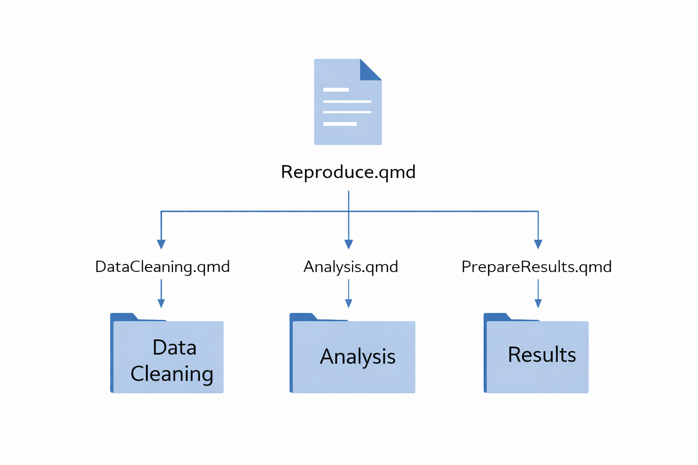
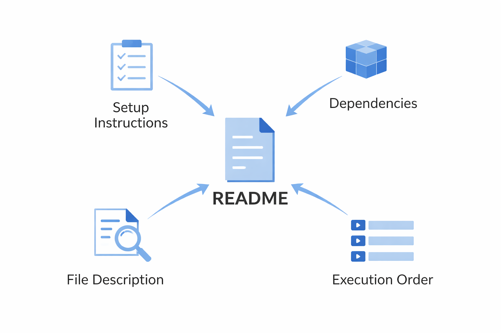

## Welcome! {.center}

+ Workshop on reproducibility in economics (applicable to scientific research more broadly).
+ Two sessions:
  + Part 1 (today): Introduction 
  + Part 2 (next session): Practical tools
+ Materials: 
  +   <a href="https://github.com/Shunkei3/Reproducibility-Workshop" target="_blank">
https://github.com/Shunkei3/Reproducibility-Workshop
</a>

 

[**Feel free to stop me at any time if you have questions or want to share your thoughts.**]{style="color:var(--light-maroon);"}

##  Outline
+ [Introduction:](#what-is-reproducibility)
  + [What is reproducibility?](#what-is-reproducibility)
  + [Current landscape of reproducibility in economics](#current-landscape)
+ [Key components of reproducible research](#key-components)
  + [Project organization](#key-components)
  + [Reproducible workflow](#key-components)
  + [Documentation](#key-components)
  + [Sharing](#sharing)
+ [Hands-on experience with example reproducible project](#example-reproducible-project)

 

::: {.callout-important}
## [ Goal of today's session]{style="color:var(--red);"}

+ Understand the core principles of reproducible research.
+ Become familiar with tools and resources for implementing reproducibility practices through hands-on experience.
:::

## What is Reproducibility? {.center}

:::{.callout-important}
## Definition: Reproducibility
*Reproducibility refers to **the ability of a researcher to duplicate the results of a prior study using the same materials as were used by the original investigator** [@Cacioppo.etal2015]*.
:::

 

In essence, reproducibility asks:

["**Can another researcher go from raw data to final results using only the materials you provide?**"]{style="color:var(--light-maroon);"}

:::{.notes}
+ Reproducing research involves using the original data and code, while replicating research involves new data collection and similar methods used in previous studies, the report says. Even when a study was rigorously conducted according to best practices, correctly analyzed, and transparently reported, it may fail to be replicated. (https://phys.org/news/2019-05-replicability-science.html)
:::

## Current landscape of reproducibility in economics

Reproducibility has always been a core scientific principle [@Vilhuber2020]. However, concerns about transparency and reproducibility have increased in recent years.

 

:::{.fragment}
### **Why now?**

- Increasingly complex data and code pipelines make studies more prone to hidden steps and undocumented decisions 
  - &rarr; difficult to reproduce results [@NationalAcademiesofSciences.etal2019].

- Recent replication efforts revealed substantial difficulties in reproducing published results in economics studies [@Chang.Li2018].
:::

:::{.fragment}
### **Current efforts to improve reproducibility in economics**
+ Leading economics journals (e.g., AER, QJE, Econometrica, JPE) now require data and code submission: 
+ For example:
  + [ AER: Data and Code Availability Policy](https://www.aeaweb.org/journals/data/data-code-policy){target="_blank"}
  + [ QJE: Data Policy](https://academic.oup.com/qje/pages/Data_Policy?login=false){target="_blank"}
:::

:::{.fragment}
[**So, what should we do to make our research reproducible in practice?**]{style="color:var(--light-maroon);"}
:::

## Key components of reproducible research {#key-components}

<!-- Start of panel-tabset -->
::: {.panel-tabset}

### Basics
::: {.callout-important}
## Minimum Rule
Every single action taken during the entire research process is **documented** in a way that anybody can follow to implement the same actions (no hidden actions) to produce exactly the same results.
:::

<!-- :::{.fragment} -->
 
The following practices can improve the quality of reproducibility:

::: {.columns}

::: {.column width="25%" .center-text}
**(i) Project organization** 

{width="65%"}
:::

::: {.column width="40%" .center-text}
**(ii) Reproducible workflow**
{width="150%"}
:::

::: {.column width="35%" .center-text}
**(iii) Documentation**
{width="100%"}
:::

<!-- ::: -->

:::
<!-- End of panel-tabset -->

### (i) Project organization {#project-organization}

::: {.callout-important}
Organize code, data, and outputs into clearly named folders and files so the project structure is easy to navigate.
:::

:::{.columns}

::: {.column width="60%"}

[**For example**]{style="color:var(--light-maroon);"}

+ Keep raw data unchanged &rarr; `Data/Raw/`
+ Store cleaned data separately &rarr; `Data/Processed/`

 

+ How you manage path also matters:
  + Avoild absolute paths in code
  + Use relative paths (e.g., `here::here()` in R)
  + If you are Rstudio user, use a project-based workflow (e.g., create `<ProjectName>.Rproj` file)
:::

:::{.column width="40%" .center-text}
{width="60%"}
:::

:::

### (ii) Reproducible workflow

::: {.callout-important}
A reproducible workflow means that the entire process—from raw data to final results—is executed through code in a clear, automated, and traceable way, with no hidden steps.
:::

[**Example workflow**]{style="color:var(--light-maroon);"}

+ `01-clean-data.qmd`
+ `02-construct-variables.qmd`
+ `03-run-analysis.qmd`
+ `04-generate-figures-tables.qmd`
+ `main.qmd` (runs everything in order)

**`main.qmd` runs everything in the correct order and reproduce all results from raw data**. 

 

[**NOTE**]{style="color:var(--light-maroon);"}: Manual edits should be minimized. If unavoidable, they should be clearly documented so others can follow the same process.

### (iii) Documentation

::: {.callout-important}
Documentation provides clear, step-by-step guidance so that others can understand and reproduce your results without guesswork.
:::

It is typically provided in a **README file**.

 

[**What should a README include?**]{style="color:var(--light-maroon);"}

+ Overview of the project 
+ Data sources and how to access them
+ Software and package requirements
+ Step-by-step instructions to reproduce results (e.g., run main.qmd)

[**Examle README files for real research project**]{style="color:var(--light-maroon);"}

+ [ andrewchbaker/JFE_DID](https://github.com/andrewchbaker/JFE_DID?utm_source=chatgpt.com){target="_blank"} - replication materials for Baker et al. (2022), JFE paper
+ [  Global-Policy-Lab/gpl-covid](https://github.com/Global-Policy-Lab/gpl-covid?utm_source=chatgpt.com){target="_blank"} - replication materials for Hsiang et al. (2020), Nature paper
:::
<!-- End of panel-tabset -->

## (iv) Sharing your project

Of course, reproducibility also requires sharing your materials in a way that others can access and use them. 

::: {.callout-important}
A reproducible project should be publicly accessible, version-controlled, and citable.
:::

### Code & project sharing

+ **Github** repositories

### Data sharing (with DOI)

+ **Zendo** ([website](https://zenodo.org/){target="_blank"}), it can be integrated with Github 
+ **Dataverse** ([website](https://guides.dataverse.org/en/latest/quickstart/what-is-dataverse.html){target="_blank"})
+ **Mendeley Data** ([website](https://data.mendeley.com/){target="_blank"})

:::{.fragment}
::: {.callout-note}
You can share code and data together on data repositories, but in many cases, **Github is used for development, while data repositories are used for placing data**.
:::
:::

:::{.notes}
+ Github is designed for code, version tracking, collaboration, but they are not ideal for uploading large datasets. Data repositories like Dataverse or Zendo are designed for stable data storage, archival purposes, and citation.
+ A DOI (Digital Object Identifier) is a standardized identifier used to uniquely identify and permanently link to digital research outputs like journal articles and datasets.
:::

## Benefits of reproducibility practices {.center}

Reproducibility practices (e.g., project organization, reproducible workflow, and detailed documentation) benefit not only the scientific community but also you and your collaborators.

 

### For you and your team:

- Easier to find mistakes and rerun your analysis
- Easier collaboration and handoffs  
- Reduced risk of errors  

### For the scientific community:

- Transparent and verifiable results  
- Lower replication costs  
- Greater credibility of research findings

## Take a look at an example of a reproducible project {.center}

We will go through an example of a reproducible project to see how the key components of reproducibility are implemented in practice.

 

**Please download the project material by cloning the following github repository**: [** Download files**](https://github.com/Shunkei3/Sample-Reproducible-Project){target="_blank"}

<!-- (https://www.dropbox.com/scl/fo/tjjib9q1xiu1okrucc1cc/ANGfjb2Bc5O6peuc0fzBwvQ?rlkey=kfukrx0krx1bigiadcuy4kxw3&st=5jsibzo1&dl=0). -->
 

You can clone the repository by:

+ Copy the URL of the repository: https://github.com/Shunkei3/Sample-Reproducible-Project.git
+ Rstudio: File > New Project > Version Control > Git > paste the URL of the repository
+ VScode: View > Command Palette > Git: Clone > paste the URL of the repository

## Example reproducible project {.center}

::: {.callout-tip}
### Check
+ README.md &rarr; How is the project is described?
+ Project folder &rarr; How are data, code, and outputs organized?
+ Code files &rarr; Why use `.qmd` files instead of `.R` files?
+ Manuscript (`writing/manuscript_to_pdf.qmd`) &rarr; How are tables and figures generated and included?
+ Workflow (`main.qmd`) &rarr; How is the entire project reproduced?
:::

 

Do you have any suggestions on how the project can be improved in terms of reproducibility?

## Key takeaways

::: {.callout-important}
Reproducible research means that anyone can go from raw data to final results using only the materials you provide.
:::

 

### Core principles
+ **Organized your project directory clearly**
  + &rarr; Use structured folders and consistent file names.

+ **Automate your workflow**
  + &rarr; Generate all results through code (no hidden steps).

+ **Document everything**
  + &rarr; Explain data, and methods, and reproduction steps.

+ **Make your work accessible**
  + &rarr; Share code and data on public repositories in a stable and citable way.

## Next Session: Practical tools for reproducibility {.center}

We will cover the practical tools in more detail in the next session! 

Do you have any suggestion on what tools you want to learn in the next session?

## References {visibility="uncounted"}